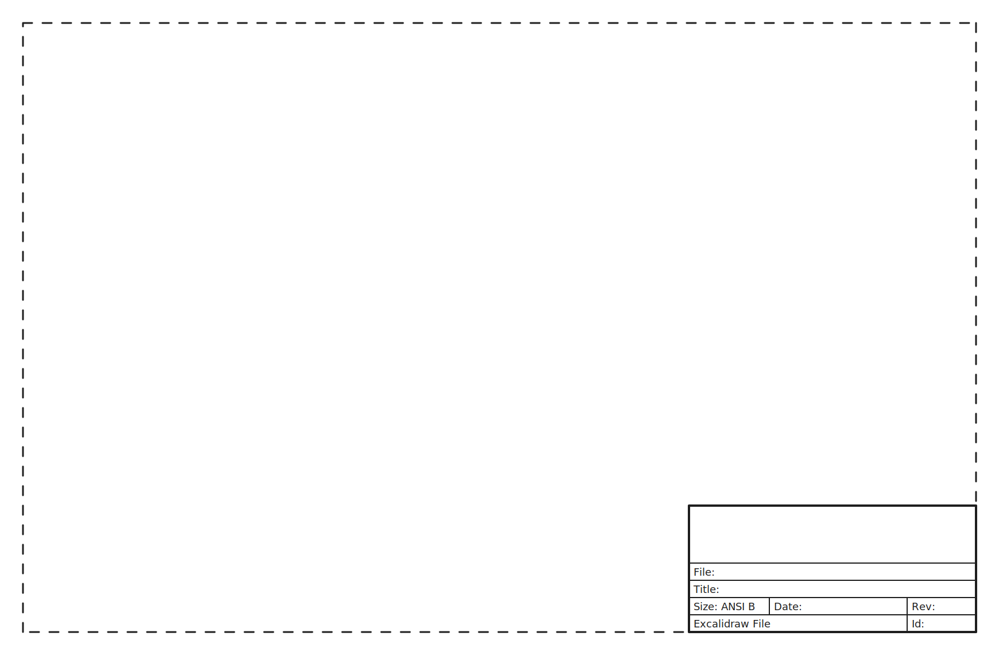

# stinger-software
Stinger Tug Core Software

## Overview


### A Closer look at the Overall structure

```
stinger_bringup
    drivers for imu, gps, camera, lidar
    launch file for publishing odom using robot localization
    launch file for publishing static tf
    node for controlling the motors
stinger_description
    urdf  of the boat
stinger_autonomy
    detection.py
    navigate.py
    state_manager.py
```

## Quick Start 
Follow INSTALL.md to install all the requirements

Bringup nodes:
```
    ros2 launch sllidar_ros2 view_sllidar_c1_launch.py
    ros2 run stinger_bringup camera-node
    ros2 launch stinger_bringup ekf.launch.py
    ros2 launch stinger_bringup tf.launch.py
```