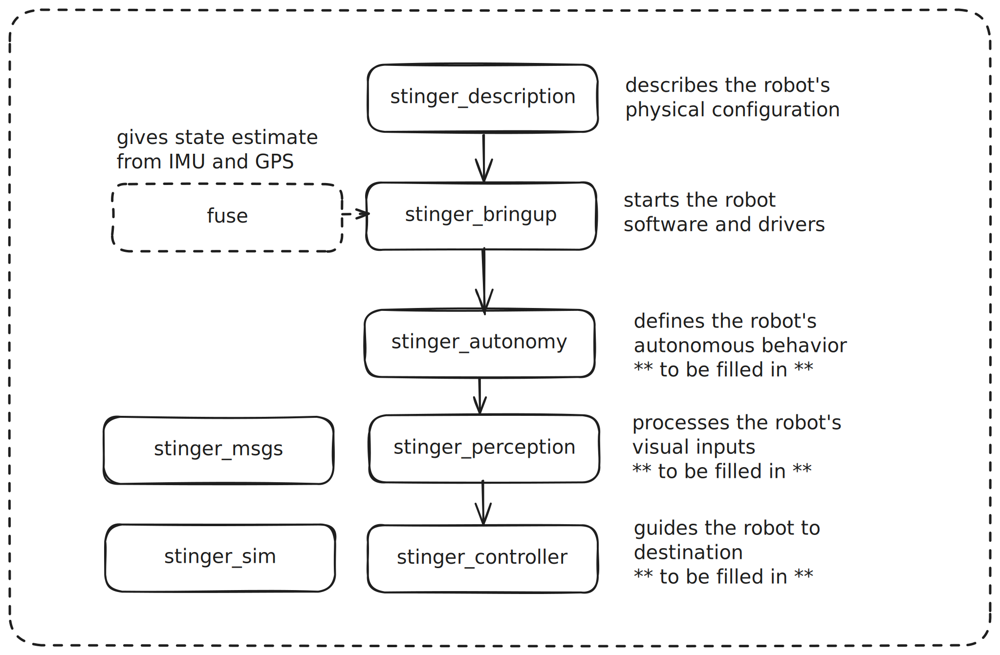

# stinger-software
Stinger Tug Core Software

## Overview


### A Closer look at the Overall structure

```
stinger_bringup
    drivers for imu, gps, camera, lidar
    launch file for publishing odom using robot localization
    launch file for publishing static tf
    node for controlling the motors
    launch file for simulation
stinger_description
    urdf  of the boat
stinger_autonomy
    state manager
stinger_controller
    velocity controller
stinger_perception
    detect the gate
stinger_sim
    simulation world definition
    hooks and bridges for sensor emulation
```

## Quick Start 
Follow INSTALL.md to install all the requirements

Before bringup, grant necessary permissions in the terminal that you are going to launch the sensor:
```
    sudo pigpiod # for motors
    sudo chmod 666 /dev/serial0 # for gps
    sudo chmod 666 /dev/video0 # for camera
```

Bringup nodes:
```
    ros2 launch stinger_bringup sensors.launch.py
        If wish to run independently:
        - ros2 launch sllidar_ros2 sllidar_c1_launch.py
        - ros2 run stinger_bringup camera-node
    ros2 launch stinger_bringup localization.launch.py
    ros2 run stinger_bringup motor-node
        - ros2 topic pub /stinger/thruster_stbd/cmd_thrust std_msgs/msg/Float64 "{data: 20.0}"
```
Autonomy nodes:
```
    ros2 run stinger_autonomy state_node
    ros2 run stinger_perception perception_node
    ros2 run stinger_controller velocity_controllor
    ros2 run stinger_controller throttle_controller
```

## Simulation Quick start
```
ros2 launch stinger_bringup vehicle_sim.launch.py
```